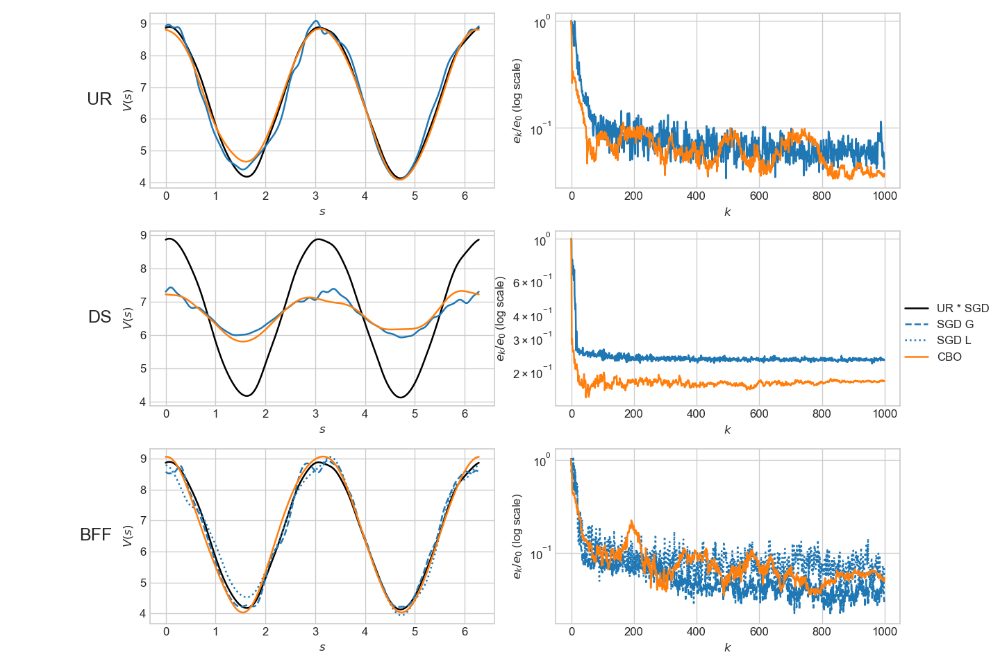
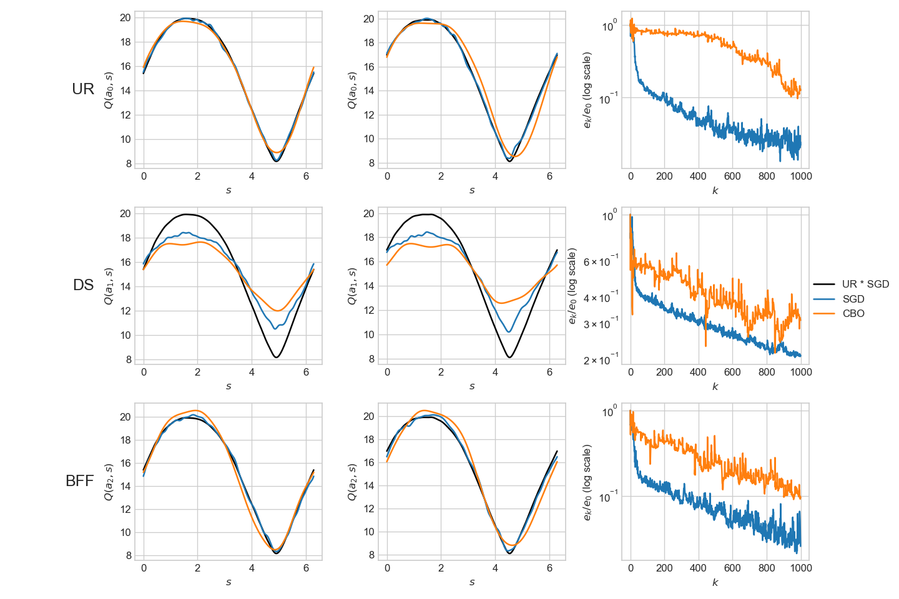
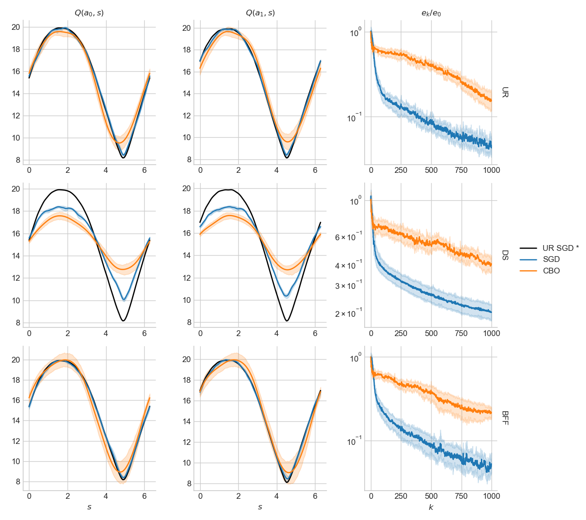

# CBO Applied to RL

## $V$ -evaluation, continuous state space (5.1.)

### Outline

- Markov decision process with a continuous state space $\mathbb S = \{s \in (0, 2\pi]\}$.
- Dynamics described by 
$$
\begin{aligned}
&s_{m+1} = s_{m} + \alpha(s_m)\epsilon + \sigma(s_m)\sqrt{\epsilon} Z_m\\
&\alpha(s) = 2 \sin(s) \cos(s), \quad \sigma(s) = 1 + \cos(s)^2, \quad \epsilon = 0.1
\end{aligned}
$$
- Immediate reward function, $R(s)=(\cos(2s)+1)$.
- Discount factor $\gamma=0.9$.
- 3 layer FCNN, $V(s;\theta)$. Two hidden layers with $\cos$ activation function, and each hidden layer contains 50 neurons.
$$
\begin{aligned}
&V(s ; \theta)=V\left(x ;\left\{w_{i}, b_{i}\right\}_{i=1}^{3}\right)=L_{w_{3}, b_{3}} \circ \cos \circ L_{w_{2}, b_{2}} \circ \cos \circ L_{w_{1}, b_{1}}((\cos s, \sin s)) \\
&L_{w_{i}, b_{i}}(x)=w_{i} x+b_{i}, \quad w_{i} \in \mathbb{R}^{n_{i-1} \times n_{i}}, \quad b_{i} \in \mathbb{R}^{n_{i}}, \quad n_{0}=2, n_{1}=n_{2}=50, n_{3}=1
\end{aligned}
$$

- $\theta^*$ is computed with Algorithms 1-4 based on trajectory $\{s_m\}_{m=1}^{10^6}$ with

$$
f\left(s_{m}, s_{m+1}, \theta\right)=R\left(s_{m}\right)+\gamma V\left(s_{m+1} ; \theta\right)-V\left(s_{m} ; \theta\right), \quad \tau=0.1, \quad M=1000
$$

- The SGD algorithm runs for a single epoch with the same initialization $\theta_0$.
- Error at step $k$, $e_k$ is defined as $e_k=\| V(\cdot,\theta_k)-V^*\|_{L^2}$.
- Reference $V^*(s)$ is computed by running Algorithm 1 for 10 epochs based on longer trajectory $\{s_m\}_{m=1}^{10^7}$, with $\tau=0.01,$ $M=1000$.
- We visualize relative error, $\log_{10}(e_k/e_0)$.

- **NB**, I made one modification from the paper:
  - Since $V(s,\theta)\mapsto V(s,\theta)+\delta$ is a symmetry in $f$, then a better way of measuring error, $e_k$, is

$$
e_k=\| V(\cdot,\theta_k)-V^* - \mu_k \|_2,\quad \mu_k = \int V(\cdot,\theta_k)-V^*
$$

### SGD vs CBO

SGD Parameters:
$$
M = 1000, \quad \text{epochs} = 1, \quad γ = 0.9, \quad τ = 0.1
$$

CBO Paramaters:
$$
\begin{aligned}
&N = 30\\
&m = 1000\\
&\text{epochs} = 1 \\
&δ = 1\times 10^{-5} && \text{Threshold of difference below which particles take a brownian motion step}\\
&η_k = \max(0.5\cdot 0.998^k,0.01) && \text{Learning rate}\\
&τ_k =  \max(0.1\cdot0.998^k,0.01) && \text{Exploration rate}\\
&β_k =  \max(30\cdot1.002^k,80) && \text{1/Characteristic energy}
\end{aligned}
$$

## $Q$-evaluation and control, continuous state space (4.1.)

### Outline

- MDP with a continuous state space $\mathbb S = \{s \in (0, 2\pi]\}$.
- Dynamics described by

$$
\begin{aligned}
&\Delta s_{m} = a_m\epsilon + \sigma \sqrt{\epsilon} Z_m\\
&a_m \in\mathbb A = \{\pm 1\}\\
&a_m\sim \pi(\cdot|s_{m-1})\\
&\varepsilon = \frac{2\pi}{32}\\
&\sigma = 0.2\\
&r(s_{m+1},s_{m},a_m) = \sin(s_{m+1})+1
\end{aligned}
$$

- 3 layer FCNN, $Q^\pi(s,a;\theta)$. Two hidden layers with $\cos$ activation function, and each hidden layer contains 50 neurons. Output layer of size $|\mathbb A|$.
- Reference $Q^*$ is computed by running UR for 10 epochs based on longer trajectory $\{s_m\}_{m=1}^{10^7}$, with $\tau=0.01,$ $M=1000.$

### $Q$-evaluation

Estimating $Q^\pi$ for fixed policy $\pi(a|s)=1/2 + a \sin(s)/5$.
$$
j^{eval}(s_m, a_m, s_{m+1};\theta) = r(s_{m+1}, s_m, a_m)  + \gamma \int Q^\pi(s_{m+1},a;\theta)\pi(a|s_{m+1})da - Q^\pi(s_m,a_m;\theta)
$$

### $Q$-control

Fixed behavior policy to generate training trajectory, $\pi(a|s)=1/|\mathbb A|$.

$$
j^{ctrl}(s_m, a_m, s_m+1;\theta) = r(s_{m+1}, s_m, a_m)  + \gamma \max_{a'} Q^\pi(s_{m+1},a';\theta) - Q^\pi(s_m,a_m;\theta)
$$

#### SGD vs CBO

SGD Parameters:
$$
M = 1000, \quad \text{epochs} = 1, \quad γ = 0.9, \quad τ = 0.1
$$
CBO Parameters:

$$
\begin{aligned}
&N = 90\\
&m = 1000\\
&\text{epochs} = 1 \\
&δ = 1\times 10^{-5} && \text{Threshold of difference below which particles take a brownian motion step}\\
&η_k = \max(0.6\cdot 0.9992^k,0.075) && \text{Learning rate}\\
&τ_k =  \max(0.8\cdot0.9992^k,0.3) && \text{Exploration rate}\\
&β_k =  \max(8\cdot1.002^k,20) && \text{1/Characteristic energy}
\end{aligned}
$$

To visualize the stability of the algorithms, we can show statistics (mean and sd) on 10 runs:

## Future Work

- Applying  rigorous approaches to hyper-parameter tuning
- Testing the CBO + BFF on more complex problems
  - Higher dimensional
  - Deeper neural networks
  - Open AI Gyms examples
  - Less smooth dynamics
- Visualizing behavior of particles in CBO

## Summary and Conclusion

From the experiments on the simple environments, we note that

- BFF and UR have similar performance using SGD and CBO, which are superior to DS, for $V$-evaluation and $Q$-control.

- CBO and SGD have similar performances with BFF, UR, and DS in $V$-evaluation,  however CBO performs worse than SGD in $Q$-control. 

Thus, we don't experience a notable advantage in the combination of BFF and CBO, for $V$-evaluation and $Q$-control, however we reaffirm the validity of BFF over DS.

