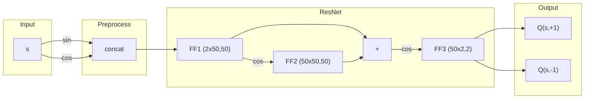
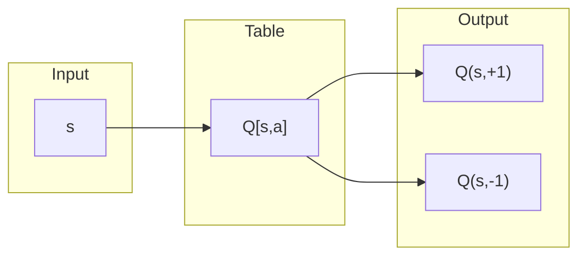

# CBO Applied to RL: Q-Control

## Dynamics and Model

### Continuous statespace

$$
\begin{aligned}
&\mathbb S = (0, 2\pi]\\
&\Delta s_{m} = a_m\epsilon + \sigma \sqrt{\epsilon} Z_m\\
&a_m \in\mathbb A = \{\pm 1\}\\
&a_m\sim \pi_b(\cdot|s_m)\\
&\varepsilon = \tfrac{2\pi}{32}\\
&\sigma = 0.2\\
&r(s_{m+1},s_{m},a_m) = \sin(s_{m+1})+1\\
&\pi_b(a|s)=\tfrac{1}{|\mathbb A|}\\
&\text{Model : ResNet}
\end{aligned}
$$

### Discrete statespace

$$
\begin{aligned}
&\mathbb S = \{\tfrac{2\pi k }{n}: k\in \mathbb Z \cap [0,n-1]\}\\
&\Delta s_{m} = \tfrac{2\pi}{n}a_m\epsilon + \sigma \sqrt{\epsilon} Z_m\\
&a_m \in\mathbb A = \{\pm 1\}\\
&a_m\sim \pi_b(\cdot|s_m)\\
& n=32\\
&\varepsilon = 1\\
&\sigma = 1\\
&r(s_{m+1},s_{m},a_m) = \sin(s_{m+1})+1\\
&\pi_b(a|s)=\tfrac{1}{2}+ a\sin(s)\\
&\text{Model : Tabular}
\end{aligned}
$$

## Optimization Methods

Bellman Residual Method (BRM)
$$
\begin{aligned}
J(\theta) &= \mathbb E[((\mathbb T^{\pi_*}-\mathbb I) Q^*(s,a;\theta))^2]\\
&= \mathbb E[\mathbb E[j^{ctrl}(s_m, a_m, s_{m+1};\theta)|s_m,a_m]^2]\\
j^{\text{ctrl}}(s_m, a_m, s_{m+1};\theta) &= r(s_{m+1}, s_m, a_m)  + \gamma \max_{a'} Q^*(s_{m+1},a';\theta) - Q^*(s_m,a_m;\theta)\\
\end{aligned}
$$

Using Batches, and a specific sampling method (UR, DS, BFF), at each iteration we get an estimate $\tilde J(\theta)$ for the loss $J(\theta)$.

### SGD

$$
\begin{aligned}
&M = 1000 && \text{Batch size}\\
&\text{epochs} = 1\\
&γ = 0.9 && \text{Discount factor}\\
&τ_k = \max(\tau_i\cdot \tau_r^k, \tau_i\cdot\tau_f) && \text{Learning rate}
\end{aligned}
$$

$$
\begin{aligned}
\Delta\theta_k = -\tau_k \nabla_\theta \tilde J(\theta)
\end{aligned}
$$
### CBO

$$
\begin{aligned}
&N = 90 && \text{Number of particles}\\
&m = 1000 && \text{Batch size}\\
&\text{epochs} = 1 \\
&γ = 0.9 && \text{Discount factor}\\
&δ = 1\times 10^{-5} && \text{Threshold of difference below which particles take a brownian motion step}\\
&η_k = \max(\eta_i\cdot \eta_r^k,\eta_i\cdot \eta_f) && \text{Learning rate}\\
&τ_k =  \max(\tau_i\cdot \tau_r^k,\tau_i\cdot\tau_f) && \text{Exploration rate}\\
&β_k =  \min(\beta_i\cdot \beta_r^k,\beta_i\cdot \beta_f) && \text{1/Characteristic energy}
\end{aligned}
$$

$$
\begin{aligned}
\bar\theta_k &= \frac{\sum_{j=1}^N \theta_k^{j} \exp(-\beta_k\tilde J(\theta))}{\sum_{j=1}^N  \exp(-\beta_k\tilde J(\theta))}\\
\Delta \theta^{j}_k &= (-\eta_k I+\tau_k\sqrt{\eta_k}\cdot Z)(\theta^j-\bar\theta); \quad Z=\text{diag}(\{z_i\sim \mathcal N(0,1)\}_{i=1}^N)
\end{aligned}
$$

## Procedure

- Policy is sampled using fixed behaviour policy $\pi_b:\mathbb A\times \mathbb S\rightarrow[0,1]$ generating long and normal trajectories.

- Reference $\theta^*$ is computed by running UR SGD for 1 epoch based on longer trajectory with $\tau=\max(0.8\cdot 0.9992^k, 0.3),$ $M=1000$.

- Perform hyperparameter optimization, using optuna, fixing $M=1000, \delta = 10^{-5}$, running 150 trials, and $90$ particles for CBO, taking error of UR as loss. $3$ Variables for SGD, $9$ for CBO.

- Average $10$ instances using best hyperparameters found, $\hat\theta$, plotting $Q(\cdot,\cdot;\theta)$, and $e_k=e(\theta_k)=\|Q(\cdot, \cdot;\theta^*)-Q(\cdot, \cdot;\theta_k)\|$.

- Visualize optimization landscape by evaluating error on affine combination of parameters of $\theta^*$ and random initialization parameters ($e(\alpha\theta^*+(1-\alpha)\theta)$ vs $\alpha\in[0,1]$) *since $e$ is a sort of "distance", then we expect it to be linear near $\alpha=1$* 

Procedure takes ~20 hours (running on 10th gen Intel i9 processor)

## Results

### Continuous + ResNet

| SGD  | $\tau$ |
| ---- | ------ |
| i    |  0.08001579582322532      |
| f    |  0.9835361410049764      |
| r    |  0.950886309322411      |

| CBO  | $\eta$ | $\tau$ | $\beta$ |
| ---- | ------ | ------ | ------ |
| i    | 0.27998130431694734 |  0.45180905444083275      | 8.51669145194007 |
| f    | 0.5194195083343263 |  0.4287097014952387      | 1.7500535407136808 |
| r    | 0.9698276350455655 |  0.9578569049519733      | 1.0213109427307054 |
### Discrete + Tabular

| SGD  | $\tau$ |
| ---- | ------ |
| i    |  4.703979337147098      |
| f    |  0.654883440315296      |
| r    |  0.9730502549231891      |

| CBO  | $\eta$ | $\tau$ | $\beta$ |
| ---- | ------ | ------ | ------ |
| i    | 0.9785432879550536 |  0.893733865582011      | 12.055703082474112 |
| f    | 0.8242055859864529 |  0.3129317992204857      | 2.6535471522264684 |
| r    | 0.9827373829994701 |  0.9999130685913801      | 1.019158705231164 |

## Conclusions

- Discrete + Tabular
  - CBO >> SGD
  - BFF > UR
- Continuous + ResNet
  - CBO < SGD
  - BFF $\sim$ UR

An important note is that  the differences noted above could be related to the number of variables in the hyper-parameter search (3 for SGD, 9 for CBO), as well as the complexity/convexity of the problem, ie. if we performed more trials, it might be possible for CBO > SGD and BFF > UR in the continuous case, although we have not observed this fact. This is also based on the fact that CBO > SGD for V-eval without hyperparameter search.
